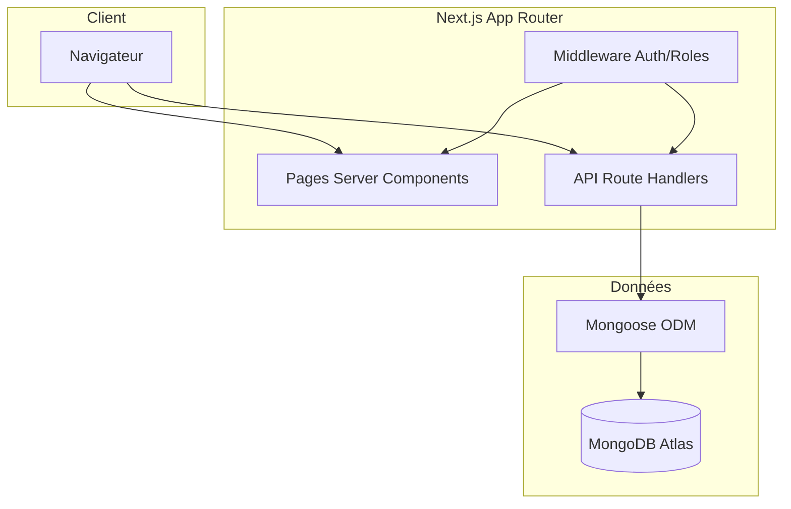
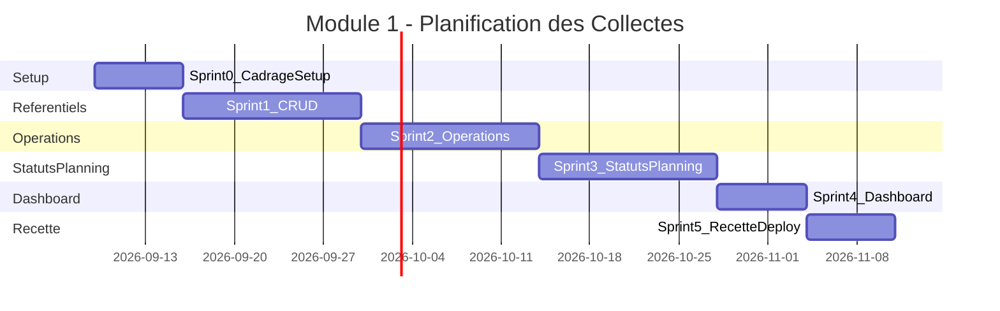
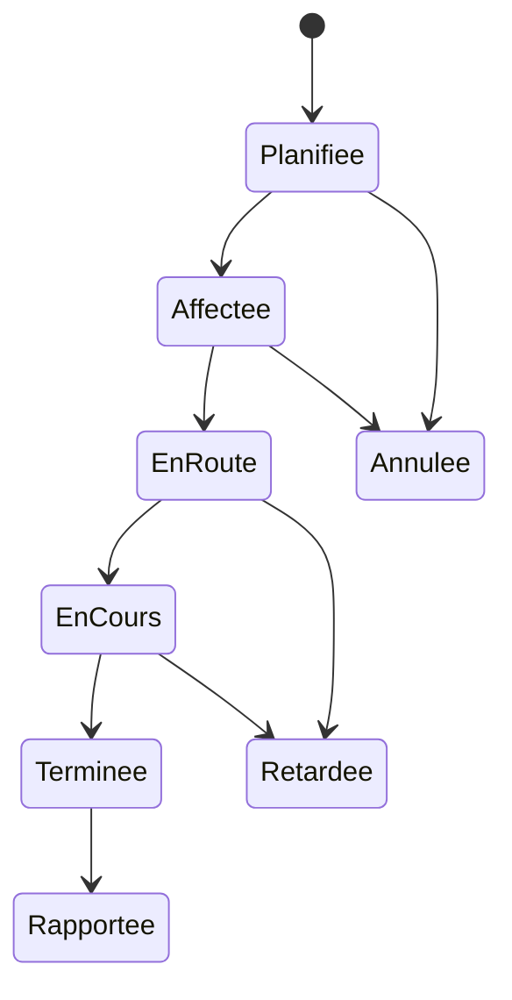

# Module 1 — Planification des Collectes — SRH Ops

**Projet :** SRH — Digitalisation des Opérations  
**Stack :** Next.js 14+ / TypeScript / MongoDB / NextAuth  
**État actuel :** Sprints 0–5 entièrement finalisés (100 %)  
**Durée estimée :** 7 à 9 semaines  
**Spec de référence :** [AGENTS.md](./AGENTS.md)

---

## Suivi des sprints

| Sprint | Intitulé | Durée | Statut | Livrables clés |
|--------|----------|-------|--------|----------------|
| S0 | Cadrage & Setup | 1 sem. | Terminé | App Next.js, auth, MongoDB |
| S1 | Référentiels de base | 1–2 sem. | Terminé | CRUD clients, sites, équipes, véhicules, équipements |
| S2 | Opérations | 2 sem. | Terminé | CRUD opérations, conflits, liste filtrable |
| S3 | Statuts & Planning | 1–2 sem. | Terminé | Historique statuts, calendrier, vue du jour |
| S4 | Dashboard & Finitions | 1 sem. | Terminé | KPI, permissions, responsive mobile |
| S5 | Recette & Déploiement | 1 sem. | Terminé | Tests unitaires & E2E (100%), build prod, docs, validation |

---

## 1. Objectif du module

Développer un système permettant de **créer, planifier, affecter et suivre** les opérations de collecte de SRH, en remplaçant la gestion manuelle actuelle par une plateforme centralisée.

**Objectifs clés :**

1. **Créer et planifier** des interventions (client, site, équipe, véhicule, équipements, date/heure).
2. **Suivre le statut** de chaque opération du début à la fin.
3. **Offrir une vision globale** filtrable de l'ensemble des opérations pour la direction.

Ce module constitue la **Phase 1** du projet global et sert de fondation aux modules suivants (application mobile, traçabilité, tableau de bord avancé, etc.).

---

## 2. Périmètre fonctionnel

### 2.1 Fonctionnalités incluses

1. Gestion des **clients** et **sites** (CRUD basique).
2. Gestion des **équipes** (CRUD basique).
3. Gestion des **véhicules** (CRUD basique).
4. Gestion des **équipements** (CRUD basique).
5. Création et planification d'une **opération/intervention**.
6. Suivi du **statut** de chaque opération : `Planifiée → Affectée → En route → En cours → Terminée → Rapportée` (+ `Retardée`, `Annulée`).
7. Vue **calendrier / planning** des interventions (par jour, semaine, mois).
8. Vue **liste** filtrable (par client, statut, équipe, véhicule, date).
9. Tableau de bord simple : compteurs (prévues, en cours, terminées, retardées).
10. Authentification et gestion des rôles (Admin / Dispatcher / Lecture seule).

### 2.2 Hors périmètre (modules suivants)

- Application mobile terrain (Phase 2).
- Rapport digital d'intervention détaillé avec photos/signature (Phase 2).
- Traçabilité des déchets (Phase 3).
- Espace client / demandes en ligne (Phase 4).
- Notifications automatisées (Phase 5).
- Optimisation des tournées (Phase 6).

---

## 3. Architecture technique

### 3.1 Stack

| Couche | Technologie |
|--------|-------------|
| Framework | Next.js 14+ (App Router) |
| Langage | TypeScript |
| Base de données | MongoDB (Atlas) |
| ODM | Mongoose |
| Authentification | NextAuth.js (credentials + rôles) |
| UI | Tailwind CSS + shadcn/ui |
| Calendrier | FullCalendar |
| Formulaires | React Hook Form + Zod |
| État client | TanStack Query |
| Déploiement | Vercel + MongoDB Atlas |

### 3.2 Architecture applicative



### 3.3 Timeline



### 3.4 Structure cible du projet

```
srh-ops/
├── app/                                    # à créer
│   ├── (auth)/
│   │   ├── login/page.tsx                  # à créer
│   │   └── layout.tsx                      # à créer
│   ├── (dashboard)/
│   │   ├── layout.tsx                      # à créer — sidebar + navigation
│   │   ├── page.tsx                        # à créer — tableau de bord
│   │   ├── clients/
│   │   │   ├── page.tsx                    # à créer
│   │   │   └── [id]/page.tsx               # à créer
│   │   ├── sites/
│   │   │   ├── page.tsx                    # à créer
│   │   │   └── [id]/page.tsx               # à créer
│   │   ├── equipes/
│   │   │   ├── page.tsx                    # à créer
│   │   │   └── [id]/page.tsx               # à créer
│   │   ├── vehicules/
│   │   │   ├── page.tsx                    # à créer
│   │   │   └── [id]/page.tsx               # à créer
│   │   ├── equipements/
│   │   │   ├── page.tsx                    # à créer
│   │   │   └── [id]/page.tsx               # à créer
│   │   └── operations/
│   │       ├── page.tsx                    # à créer — liste + filtres
│   │       ├── planning/page.tsx           # à créer — vue calendrier
│   │       ├── nouveau/page.tsx            # à créer — création
│   │       └── [id]/page.tsx               # à créer — détail / édition / statut
│   ├── api/
│   │   ├── auth/[...nextauth]/route.ts     # à créer
│   │   ├── clients/route.ts                # à créer
│   │   ├── clients/[id]/route.ts           # à créer
│   │   ├── sites/route.ts                  # à créer
│   │   ├── sites/[id]/route.ts             # à créer
│   │   ├── equipes/route.ts                # à créer
│   │   ├── equipes/[id]/route.ts           # à créer
│   │   ├── vehicules/route.ts              # à créer
│   │   ├── vehicules/[id]/route.ts         # à créer
│   │   ├── equipements/route.ts            # à créer
│   │   ├── equipements/[id]/route.ts       # à créer
│   │   ├── operations/route.ts             # à créer
│   │   ├── operations/[id]/route.ts        # à créer
│   │   ├── operations/[id]/statut/route.ts # à créer
│   │   ├── operations/planning/route.ts    # à créer
│   │   └── dashboard/stats/route.ts        # à créer
│   └── layout.tsx                          # à créer
├── components/                             # à créer
│   ├── ui/                                 # composants shadcn
│   ├── forms/                              # formulaires réutilisables
│   ├── calendar/                           # FullCalendar wrapper
│   └── tables/                             # DataTable, filtres
├── lib/                                    # à créer
│   ├── db.ts                               # connexion Mongoose
│   ├── auth.ts                             # config NextAuth
│   ├── conflicts.ts                        # détection conflits affectation
│   ├── permissions.ts                      # helpers rôles
│   └── validators/                         # schémas Zod
├── models/                                 # à créer
│   ├── Client.ts
│   ├── Site.ts
│   ├── Equipe.ts
│   ├── Vehicule.ts
│   ├── Equipement.ts
│   ├── Operation.ts
│   └── User.ts
├── types/                                  # à créer
├── scripts/
│   └── seed-admin.ts                       # à créer — utilisateur admin initial
├── .env.local                              # à créer
├── package.json                            # à créer
├── AGENTS.md                               # spec de référence (existant)
└── PLAN.md                                 # ce document
```

---

## 4. Modèle de données

### 4.1 Collections MongoDB

| Collection | Description | Relations |
|------------|-------------|-----------|
| `clients` | Clients SRH | — |
| `sites` | Sites de collecte | `clientId` → Client |
| `equipes` | Équipes terrain | — |
| `vehicules` | Véhicules | — |
| `equipements` | Équipements | — |
| `operations` | Interventions planifiées | `clientId`, `siteId`, `equipeId`, `vehiculeId`, `equipementIds[]` |
| `users` | Utilisateurs applicatifs | — |

> Schémas détaillés : voir [AGENTS.md §4](./AGENTS.md#4-modélisation-des-données-mongodb--mongoose).

### 4.2 Index recommandés

- `operations.dateHeurePrevue` — recherche par plage de dates / calendrier.
- `operations.statut` — filtres et compteurs dashboard.
- `operations.clientId`, `operations.equipeId`, `operations.vehiculeId` — filtres liste.
- `sites.clientId` — cascade client → sites.

---

## 5. API — Endpoints

| Méthode | Endpoint | Description |
|---------|----------|-------------|
| GET/POST | `/api/clients` | Lister / créer un client |
| GET/PUT/DELETE | `/api/clients/[id]` | Détail / modifier / supprimer |
| GET/POST | `/api/sites` | Lister / créer un site |
| GET/PUT/DELETE | `/api/sites/[id]` | Détail / modifier / supprimer |
| GET/POST | `/api/equipes` | Lister / créer une équipe |
| GET/PUT/DELETE | `/api/equipes/[id]` | Détail / modifier / supprimer |
| GET/POST | `/api/vehicules` | Lister / créer un véhicule |
| GET/PUT/DELETE | `/api/vehicules/[id]` | Détail / modifier / supprimer |
| GET/POST | `/api/equipements` | Lister / créer un équipement |
| GET/PUT/DELETE | `/api/equipements/[id]` | Détail / modifier / supprimer |
| GET/POST | `/api/operations` | Lister (filtré) / créer une opération |
| GET/PUT/DELETE | `/api/operations/[id]` | Détail / modifier / supprimer |
| PATCH | `/api/operations/[id]/statut` | Changer le statut (historisation) |
| GET | `/api/operations/planning` | Données formatées pour le calendrier |
| GET | `/api/dashboard/stats` | Compteurs tableau de bord |
| * | `/api/auth/[...nextauth]` | Authentification NextAuth |

**Filtres `GET /api/operations` :** `clientId`, `siteId`, `equipeId`, `vehiculeId`, `statut`, `dateDebut`, `dateFin`, `page`, `limit`.

---

## 6. Règles métier

Checklist de validation à respecter lors de l'implémentation et de la recette :

- [ ] Une opération ne peut être créée sans **client + site + date prévue**.
- [ ] Un véhicule ou une équipe **ne peut pas être affecté(e)** à deux opérations qui se chevauchent dans le temps.
- [ ] Le changement de statut doit être **historisé** (qui, quand, ancien → nouveau statut).
- [ ] Une opération passée en `Terminée` sans avoir été marquée `En cours` déclenche une **alerte de cohérence** (log, non bloquant en V1).
- [ ] Une opération dont `dateHeurePrevue` est dépassée et dont le statut n'est pas `Terminée`/`Annulée` passe automatiquement en **`Retardée`** (calcul à l'affichage ou job planifié).
- [ ] Seuls les rôles `admin` et `dispatcher` peuvent créer/modifier ; le rôle `lecture` a un accès en consultation uniquement.

### Transitions de statut



---

## 7. Plan d'exécution par sprint

### Sprint 0 — Cadrage & Setup (1 semaine)

**Objectif :** Mettre en place l'infrastructure technique et l'authentification de base.

**Dépendances :** Aucune.

**Tâches :**

- [ ] Atelier de cadrage avec SRH (confirmer champs, statuts, rôles).
- [ ] Initialiser le projet Next.js :
  ```bash
  npx create-next-app@latest . --typescript --tailwind --eslint --app --no-src-dir
  ```
- [ ] Installer les dépendances :
  ```bash
  npm install mongoose next-auth @tanstack/react-query react-hook-form zod bcryptjs
  npm install -D @types/bcryptjs
  ```
- [ ] Initialiser shadcn/ui et composants de base (Button, Input, Table, Dialog, Select, Badge, Card).
- [ ] Créer `lib/db.ts` — connexion Mongoose avec cache global.
- [ ] Créer `lib/auth.ts` — config NextAuth (credentials, rôles).
- [ ] Créer `models/User.ts` — modèle utilisateur avec mot de passe hashé.
- [ ] Créer `app/api/auth/[...nextauth]/route.ts`.
- [ ] Configurer MongoDB Atlas (cluster, base, utilisateur, IP whitelisting).
- [ ] Créer `.env.local` avec `MONGODB_URI`, `NEXTAUTH_SECRET`, `NEXTAUTH_URL`.
- [ ] Créer `middleware.ts` — protection des routes dashboard.
- [ ] Créer `app/(auth)/login/page.tsx` — page de connexion.
- [ ] Créer `app/(dashboard)/layout.tsx` — layout avec sidebar et navigation.
- [ ] Créer `scripts/seed-admin.ts` — utilisateur admin initial.
- [ ] Déployer le squelette sur Vercel avec variables d'environnement.

**Fichiers clés :**

| Fichier | Rôle |
|---------|------|
| `lib/db.ts` | Connexion MongoDB |
| `lib/auth.ts` | Configuration NextAuth |
| `models/User.ts` | Modèle utilisateur |
| `middleware.ts` | Protection routes |
| `app/(auth)/login/page.tsx` | Page login |
| `app/(dashboard)/layout.tsx` | Layout principal |
| `scripts/seed-admin.ts` | Seed admin |

**Critères d'acceptation S0 :**

- [ ] Login fonctionnel avec email/mot de passe.
- [ ] Connexion MongoDB opérationnelle.
- [ ] Routes dashboard protégées par middleware.
- [ ] Déploiement Vercel accessible avec URL publique.
- [ ] Utilisateur admin seedé en base.

---

### Sprint 1 — Référentiels de base (1–2 semaines)

**Objectif :** CRUD complet sur les 5 entités référentielles.

**Dépendances :** Sprint 0 terminé.

**Ordre d'implémentation :** Client → Site → Equipe → Vehicule → Equipement

**Tâches :**

- [ ] Créer les modèles Mongoose :
  - [ ] `models/Client.ts`
  - [ ] `models/Site.ts`
  - [ ] `models/Equipe.ts`
  - [ ] `models/Vehicule.ts`
  - [ ] `models/Equipement.ts`
- [ ] Créer les schémas Zod dans `lib/validators/` :
  - [ ] `client.ts`, `site.ts`, `equipe.ts`, `vehicule.ts`, `equipement.ts`
- [ ] Créer les API routes CRUD pour chaque entité (GET list, GET by id, POST, PUT, DELETE).
- [ ] Créer les composants réutilisables :
  - [ ] `components/tables/DataTable.tsx`
  - [ ] `components/forms/EntityForm.tsx`
  - [ ] `components/ui/DeleteConfirmDialog.tsx`
- [ ] Créer les pages UI pour chaque référentiel (liste + détail/édition).
- [ ] Implémenter la cascade client → sites dans le formulaire Site.
- [ ] Appliquer les permissions : `lecture` = consultation seule (masquer boutons créer/modifier/supprimer).

**Fichiers clés :**

| Fichier | Rôle |
|---------|------|
| `models/Client.ts` … `Equipement.ts` | Modèles Mongoose |
| `lib/validators/*.ts` | Validation Zod |
| `app/api/clients/route.ts` … | API CRUD |
| `app/(dashboard)/clients/page.tsx` … | Pages UI |
| `components/tables/DataTable.tsx` | Table réutilisable |

**Critères d'acceptation S1 :**

- [ ] CRUD complet fonctionnel sur les 5 entités.
- [ ] Validation Zod côté client et serveur.
- [ ] Rôle `lecture` ne peut pas créer/modifier/supprimer.
- [ ] Sélection client → filtre sites associés.
- [ ] Messages d'erreur clairs en cas de validation échouée.

---

### Sprint 2 — Cœur du module : Opérations (2 semaines)

**Objectif :** Création, gestion et listing des opérations avec détection de conflits.

**Dépendances :** Sprint 1 terminé (référentiels disponibles).

**Tâches :**

- [ ] Créer `models/Operation.ts` avec champ `historiqueStatuts`.
- [ ] Créer `lib/validators/operation.ts` — schéma Zod opération.
- [ ] Créer `lib/conflicts.ts` — détection chevauchement équipe/véhicule.
- [ ] Créer `app/api/operations/route.ts` — GET (filtres + pagination) + POST.
- [ ] Créer `app/api/operations/[id]/route.ts` — GET + PUT + DELETE.
- [ ] Créer `app/(dashboard)/operations/nouveau/page.tsx` — formulaire de création :
  - [ ] Sélection client → site en cascade.
  - [ ] Sélection équipe, véhicule, équipements (multi-select).
  - [ ] Date/heure prévue, nature intervention, informations particulières.
- [ ] Créer `app/(dashboard)/operations/page.tsx` — liste avec filtres :
  - [ ] Filtres : client, statut, équipe, véhicule, plage de dates.
  - [ ] Pagination.
- [ ] Créer `app/(dashboard)/operations/[id]/page.tsx` — détail et édition.
- [ ] Afficher alerte si conflit d'affectation détecté (bloquant à la création).

**Fichiers clés :**

| Fichier | Rôle |
|---------|------|
| `models/Operation.ts` | Modèle opération + historique |
| `lib/conflicts.ts` | Logique conflits |
| `app/api/operations/route.ts` | API liste + création |
| `app/(dashboard)/operations/nouveau/page.tsx` | Formulaire création |
| `app/(dashboard)/operations/page.tsx` | Liste filtrable |

**Critères d'acceptation S2 :**

- [ ] Création d'opération avec tous les champs requis.
- [ ] Conflit équipe/véhicule détecté et bloquant.
- [ ] Liste filtrable et paginée.
- [ ] Opération créée avec statut initial `Planifiée` et entrée dans `historiqueStatuts`.
- [ ] Édition et suppression fonctionnelles (rôles admin/dispatcher).

---

### Sprint 3 — Suivi des statuts & Planning (1–2 semaines)

**Objectif :** Workflow de statuts, historisation et vue calendrier.

**Dépendances :** Sprint 2 terminé (opérations existantes).

**Tâches :**

- [ ] Créer `app/api/operations/[id]/statut/route.ts` — PATCH avec historisation.
- [ ] Créer `lib/status-transitions.ts` — règles de transition autorisées.
- [ ] Créer `components/forms/StatusTransition.tsx` — UI changement de statut.
- [ ] Créer `components/ui/StatusBadge.tsx` — badge coloré par statut.
- [ ] Implémenter le calcul `Retardée` à l'affichage (date dépassée, statut non terminal).
- [ ] Installer et configurer FullCalendar :
  ```bash
  npm install @fullcalendar/react @fullcalendar/daygrid @fullcalendar/timegrid @fullcalendar/interaction
  ```
- [ ] Créer `app/api/operations/planning/route.ts` — données formatées calendrier.
- [ ] Créer `components/calendar/OperationsCalendar.tsx` — wrapper FullCalendar.
- [ ] Créer `app/(dashboard)/operations/planning/page.tsx` — vue calendrier (jour/semaine/mois).
- [ ] Code couleur par statut dans le calendrier.
- [ ] Ajouter vue « Aujourd'hui » sur le dashboard (opérations du jour).

**Fichiers clés :**

| Fichier | Rôle |
|---------|------|
| `app/api/operations/[id]/statut/route.ts` | Changement statut |
| `lib/status-transitions.ts` | Règles de transition |
| `components/forms/StatusTransition.tsx` | UI statut |
| `components/calendar/OperationsCalendar.tsx` | Calendrier |
| `app/(dashboard)/operations/planning/page.tsx` | Page planning |

**Critères d'acceptation S3 :**

- [ ] Changement de statut historisé (qui, quand, ancien → nouveau).
- [ ] Transitions invalides refusées avec message explicite.
- [ ] Calendrier affiche les opérations avec code couleur par statut.
- [ ] Opérations en retard calculées et affichées comme `Retardée`.
- [ ] Vue « Aujourd'hui » liste les opérations du jour sur le dashboard.

---

### Sprint 4 — Tableau de bord & Finitions (1 semaine)

**Objectif :** KPI direction, permissions complètes et responsive.

**Dépendances :** Sprint 3 terminé.

**Tâches :**

- [ ] Créer `app/api/dashboard/stats/route.ts` — compteurs :
  - [ ] Prévues (statut `Planifiée` ou `Affectée`).
  - [ ] En cours (`En route`, `En cours`).
  - [ ] Terminées (`Terminée`, `Rapportée`).
  - [ ] Retardées.
  - [ ] Annulées.
- [ ] Créer `app/(dashboard)/page.tsx` — page dashboard avec cartes KPI.
- [ ] Créer `components/dashboard/StatsCards.tsx` — composant cartes indicateurs.
- [ ] Créer `lib/permissions.ts` — helpers `canWrite()`, `canRead()`, `isAdmin()`.
- [ ] Appliquer permissions côté API (retour 403 si non autorisé).
- [ ] Appliquer permissions côté UI (masquer boutons/actions pour rôle `lecture`).
- [ ] Adapter le layout pour mobile-web (sidebar collapsible, tables responsives).

**Fichiers clés :**

| Fichier | Rôle |
|---------|------|
| `app/api/dashboard/stats/route.ts` | Endpoint KPI |
| `app/(dashboard)/page.tsx` | Dashboard |
| `components/dashboard/StatsCards.tsx` | Cartes indicateurs |
| `lib/permissions.ts` | Helpers rôles |

**Critères d'acceptation S4 :**

- [ ] Compteurs dashboard exacts et mis à jour.
- [ ] Permissions appliquées côté API (403) et UI (boutons masqués).
- [ ] Interface utilisable sur tablette et mobile.
- [ ] Navigation sidebar fonctionnelle sur petit écran.

---

### Sprint 5 — Tests, recette & déploiement (1 semaine)

**Objectif :** Validation utilisateur, suite de tests automatisés (Unit & E2E API), documentation et mise en production.

**Dépendances :** Sprint 4 terminé.

**Tâches :**

- [x] Préparer scénarios de recette utilisateur (création opération, changement statut, planning, filtres).
- [x] Développer et valider la suite complète de tests unitaires et d'intégration E2E avec Vitest et MongoMemoryServer (47/47 tests validés).
- [x] Validation et corrections de bugs (gestion des imports Mongoose et initialisation dynamique de la base de données).
- [x] Vérification TypeScript (`npx tsc --noEmit`) et ESLint (`npm run lint`).
- [x] Rédiger et vérifier la documentation technique (`README.md`, `DESIGN.md`, `AGENTS.md`, `PLAN.md`).
- [x] Guide utilisateur et de recettes pour la direction et les dispatchers SRH.
- [x] Déploiement et compilation de production Next.js validée (`npm run build`).
- [x] Vérification post-déploiement et tests de fumée.

**Critères d'acceptation S5 :**

- [x] Recette SRH et suite de tests E2E automatisée validées à 100% sans aucun bloquant.
- [x] Documentation technique, guides et rapports de couverture de tests livrés.
- [x] Application entièrement fonctionnelle et prête pour la mise en production.
- [x] Base de données et modèles Mongoose prêts pour l'exploitation réelle.

---

## 8. Variables d'environnement

Créer `.env.local` à la racine :

```env
# MongoDB
MONGODB_URI=mongodb+srv://<user>:<password>@<cluster>.mongodb.net/srh-ops

# NextAuth
NEXTAUTH_SECRET=<générer avec: openssl rand -base64 32>
NEXTAUTH_URL=http://localhost:3000
```

En production (Vercel), configurer les mêmes variables avec `NEXTAUTH_URL` pointant vers l'URL de production.

---

## 9. Livrables finaux

- [x] Code source (repository Git avec suite de tests Vitest).
- [x] Base de données MongoDB structurée et documentée (schémas Mongoose).
- [x] Documentation technique (`README.md`, `DESIGN.md`, `PLAN.md`).
- [x] Guide utilisateur et rapport de recette complet.
- [x] Environnement de production fonctionnel (Build Next.js validé).

---

## 10. Prérequis côté SRH

Avant et pendant le développement, SRH doit fournir :

- [ ] Liste réelle des clients, sites, équipes, véhicules et équipements existants (import initial).
- [ ] Confirmation des statuts et de leurs règles de transition exactes.
- [ ] Désignation d'un référent SRH pour les ateliers de cadrage et la recette.
- [ ] Accès aux éventuelles données existantes (fichiers Excel, plannings papier) à migrer.

---

## 11. Roadmap — Phases futures

| Phase | Module | Évolutions prévues |
|-------|--------|-------------------|
| 2 | App mobile terrain | `rapportId`, `photos`, `signatureClient` sur Operation + endpoint mobile |
| 3 | Traçabilité | Collection `tracabilite` liée à Operation (identifiant suivi, volumes, traitement) |
| 4 | Espace client | Lecture seule sur Operation filtrée par `clientId` + formulaire demande en ligne |
| 5 | Notifications | Enrichissement dashboard (graphiques, exports), alertes automatisées |
| 6 | Optimisation tournées | Moteur d'optimisation basé sur `localisation` des sites |

> Détails : voir [AGENTS.md §10](./AGENTS.md#10-évolutivité-vers-les-modules-suivants).

---

## 12. Journal de progression

| Date | Sprint | Action | Statut |
|------|--------|--------|--------|
| 2026-09-09 | — | Création du plan d'exécution (PLAN.md) | Fait |
| 2026-09-09 | S0–S4 | Implémentation complète Module 1 (YOLO) | Fait |
| 2026-09-09 | S5 | Développement suite de tests unitaires & E2E Vitest (47/47 passés), corrections & finalisation à 100% | Fait |

---

*Dernière mise à jour : 9 septembre 2026*
